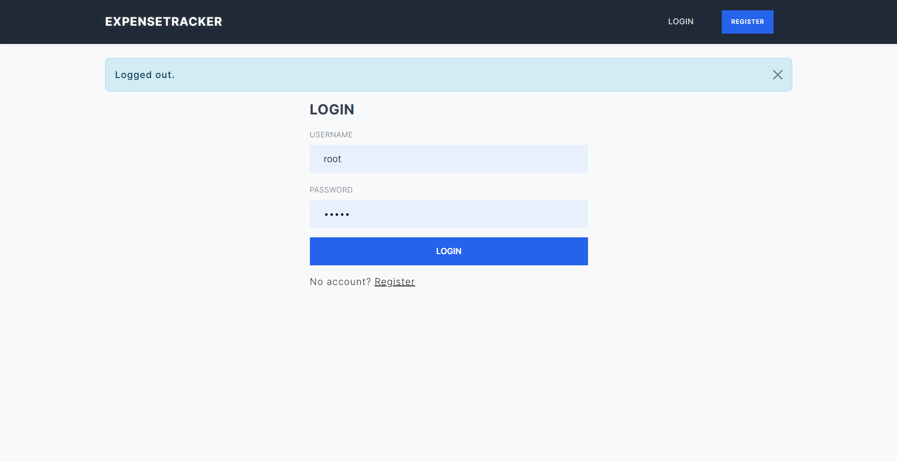
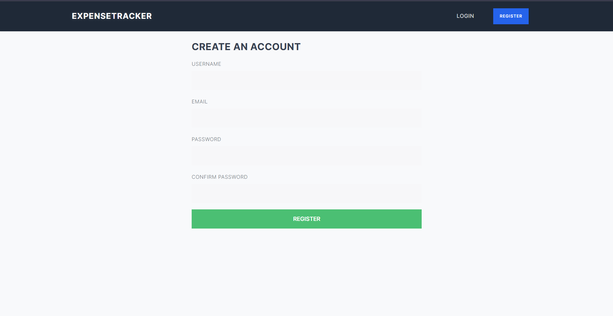
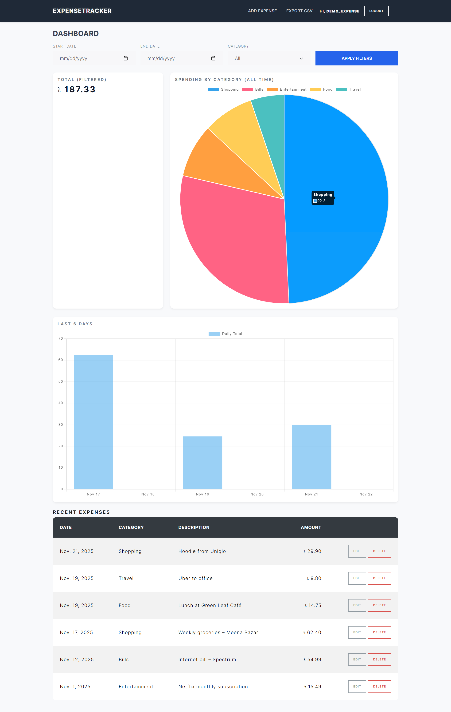
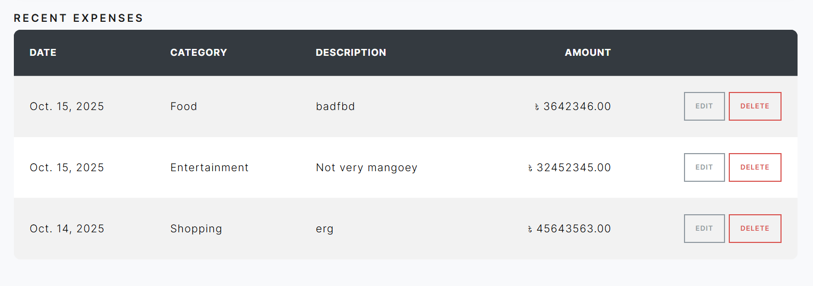
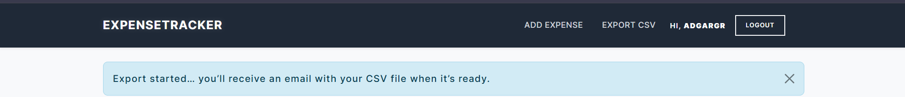
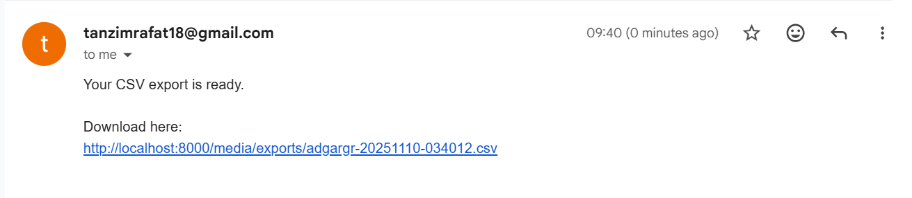
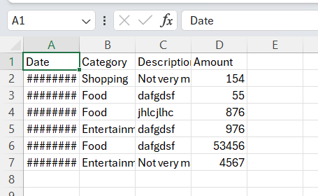

# Expense Tracker

A full-stack Django web application for managing personal expenses.  
It allows users to record daily expenses, categorize them, visualize spending patterns, and export summaries easily.  
The project includes background task automation with Celery and caching with Redis for better performance.

## Live Demo

 [View the app on Render](https://expense-tracker-lv69.onrender.com)

> You can register a test account to explore features like adding expenses, filtering by category, and viewing charts.  
> **Note:** The "Export CSV" feature won’t send actual emails on Render because SMTP is blocked on the free plan. 
> It works when running locally.

> **Note:** The live demo is hosted on Render's free tier,  
> so it might take 30–60 seconds to start if the service was idle.
> Please wait a bit after opening the link — it’ll load shortly.

---
### Demo Login
You can log in directly using this demo account:

**Username:** demo_user!  
**Password:** DemoPass123

## Screenshots

### Login Page


### Register Page


### Dashboard (Overview + Charts)


### Recent Expenses List


### Export CSV Feature


### Email Received (CSV Export Result)


### Example of Exported CSV File


## Overview

This project was built to learn and implement real-world Django concepts such as authentication, PostgreSQL integration, background task processing, Docker containerization, and deployment using Render.

The application lets a logged-in user:
- Add, update, and delete expense records
- Filter expenses by date range or category
- View monthly and category-based spending summaries
- Export expense data as a CSV file (generated asynchronously using Celery)
- Receive automatic monthly summary emails
- Run fully inside Docker containers for easy setup and deployment

## Tech Stack

- Backend: Django, Celery  
- Frontend: HTML, CSS, JavaScript  
- Database: PostgreSQL  
- Cache / Message Broker: Redis  
- Task Queue: Celery  
- Containerization: Docker, Docker Compose  
- Deployment: Render  

## Features

1. User Authentication  
   Register, login, and logout using Django’s authentication system.

2. Expense Management  
   CRUD operations for expenses. Each expense belongs to the logged-in user.

3. Filtering and Summaries  
   Filter expenses by start date, end date, or category.  
   View total expenses and see pie and bar charts of spending trends.

4. CSV Export  
   Exports are processed asynchronously using Celery and emailed to the user.

5. Scheduled Monthly Email  
   Celery Beat sends automated monthly summaries.

6. Dockerized Setup  
   Includes Docker and Docker Compose for easy setup of Django, PostgreSQL, Redis, and Celery.

7. Deployment Ready  
   Works seamlessly on Render using Docker and environment variables.

## Project Structure

```
expense_tracker/
│
├── Dockerfile
├── docker-compose.yml
├── manage.py
├── requirements.txt
├── README.md
│
├── expense_tracker/        # main project folder (settings, urls, wsgi, celery config)
│
└── expenses/               # main app (models, views, forms, tasks, templates)
```


